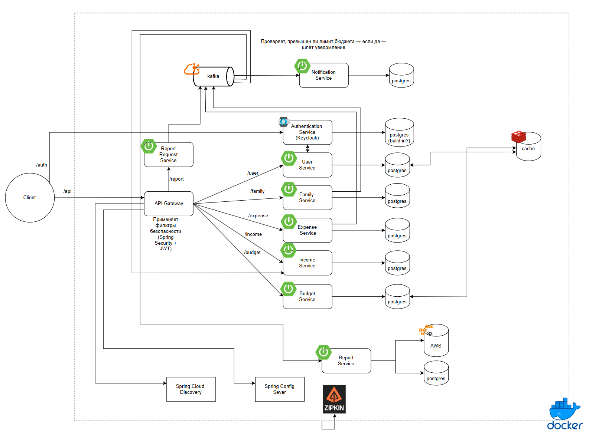

# Family Budget

**Family Budget** — это разрабатываемое микросервисное приложение для ведения и анализа семейного бюджета с гибкой системой ролей, отчётности и нотификаций.

---

## 🚧 Статус проекта

Архитектура строится на современных подходах с использованием Java 17, Spring Boot, PostgreSQL, Kafka, Redis, Docker и Zipkin. В дальнейшем планируется развёртывание в Kubernetes и добавление CI/CD пайплайна.

---

## 📌 Описание

Система предназначена для:

- учёта доходов и расходов семьи;
- формирования и контроля бюджета;
- генерации отчётов;
- отправки уведомлений при превышении бюджета.

Поддерживается event-driven архитектура и масштабируемость за счёт изолированных сервисов и брокера сообщений Kafka.

---

## 🧩 Архитектура

Архитектура построена на Spring Cloud. Аутентификация реализована через Keycloak, коммуникация между сервисами осуществляется через Kafka, трейсинг — через Zipkin, конфигурации — через Spring Config Server.

📎 _Архитектурная схема:_

 <!-- Убедитесь, что файл находится по пути ./assets -->

---

## 🧱 Стек технологий

- **Java 17**, **Spring Boot**, **Spring Cloud**, **Spring Security**, **JWT**, **Keycloak**
- **Kafka**, **Redis**, **PostgreSQL**
- **Docker**, **Docker Compose**, **Zipkin**
- **AWS S3** (для хранения отчётов)

---

## 📦 Сервисы

| Сервис             | Описание |
|--------------------|----------|
| API Gateway        | Внешняя точка входа, фильтры безопасности |
| Auth Service       | Аутентификация через Keycloak |
| User Service       | CRUD пользователей |
| Family Service     | Работа с семейными аккаунтами |
| Expense            | Учёт расходов |
| Income             | Учёт доходов  |
| Budget Service     | Хранение бюджета и лимитов |
| Notification       | Проверка лимитов, отправка уведомлений |
| Report Request     | Запросы на генерацию отчётов |
| Report Service     | Генерация и выгрузка отчётов в S3 |

---

## 📍 Планы

- [ ] Реализация UI
- [ ] Добавление unit и integration тестов
- [ ] Поддержка нескольких валют
- [ ] CI/CD пайплайн на GitHub Actions
- [ ] Helm chart для деплоя в Kubernetes

